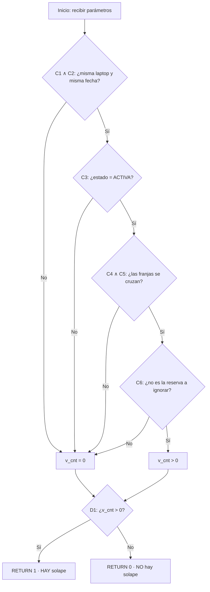

# Prueba de Caja Blanca — `fn_reserva_solapa_laptop`

> **Sistema:** BiblioGuest · **Responsable:** Maye · **Sección del informe:** 3 (Diseño de Casos de Prueba)
> **Ubicación en el repo:** `oracle/setup/03_storeObjects.sql` (líneas 46–71)

## 1. ¿Por qué esta función?

`fn_reserva_solapa_laptop` es la función PL/SQL que decide si una nueva reserva de laptop
**choca en horario** con otra reserva activa del mismo equipo. Es el corazón del módulo de
reservas (el más crítico del sistema) y se invoca desde **dos puntos**:

- El procedimiento `pr_reservar_laptop` (línea 427), antes de insertar la reserva.
- El trigger `trg_rl_no_solape` (línea 561), como segunda barrera al insertar/actualizar.

Un defecto aquí produce el **Riesgo R1 (doble reserva)** identificado en el análisis de riesgos.

## 2. Código bajo prueba

```sql
CREATE OR REPLACE FUNCTION fn_reserva_solapa_laptop(
  p_id_laptop   NUMBER,
  p_fecha       DATE,
  p_ini         VARCHAR2,
  p_fin         VARCHAR2,
  p_ignorar_id  NUMBER DEFAULT NULL
) RETURN NUMBER IS
  PRAGMA AUTONOMOUS_TRANSACTION;
  v_cnt NUMBER;
BEGIN
  SELECT COUNT(*)
    INTO v_cnt
    FROM ReservaLaptop r
   WHERE r.id_laptop = p_id_laptop                                          -- C1
     AND r.fecha_reserva = p_fecha                                          -- C2
     AND UPPER(r.estado) = 'ACTIVA'                                         -- C3
     AND fn_build_ts(r.fecha_reserva, r.hora_inicio) < fn_build_ts(p_fecha, p_fin)  -- C4
     AND fn_build_ts(r.fecha_reserva, r.hora_fin)    > fn_build_ts(p_fecha, p_ini)  -- C5
     AND (p_ignorar_id IS NULL OR r.id_reserva != p_ignorar_id);            -- C6

  RETURN CASE WHEN v_cnt > 0 THEN 1 ELSE 0 END;                             -- D1
END;
```

**Lógica de solape (C4 ∧ C5):** dos franjas `[ini_existente, fin_existente)` y `[p_ini, p_fin)`
se solapan si y solo si `ini_existente < p_fin` **y** `fin_existente > p_ini`. Al usar
comparadores **estrictos** (`<`, `>`), una reserva que termina exactamente cuando empieza la
otra (ej. 09:00–11:00 y 11:00–13:00) **no** cuenta como solape — comportamiento deseado.

## 3. Grafo de flujo de control

La función tiene una sola consulta con 6 condiciones encadenadas por `AND` y una decisión final.
Para efectos de cobertura de condiciones, cada `Ci` es un predicado independiente:



**Complejidad ciclomática:** `V(G) = P + 1`, con `P = 7` predicados simples
(C1, C2, C3, C4, C5, C6 —donde C6 contiene un `OR` interno— y D1) → **V(G) = 8**.
Se necesitan como mínimo 8 casos para cobertura de condiciones; con los 7 casos de la
sección 4 se logra **cobertura de decisión completa** (cada condición evaluada a
verdadero y falso al menos una vez).

## 4. Casos de prueba de caja blanca

Contexto común: existe una reserva **ACTIVA** de la laptop **L3** el **2026-07-20** de **09:00 a 11:00** (id_reserva = 100).

| ID | Condición ejercitada | Entradas (`p_id_laptop, p_fecha, p_ini, p_fin, p_ignorar_id`) | Resultado esperado | Camino |
|------|----------------------|------------------------------------------------------------|--------------------|--------|
| CB-01 | C1 falsa (otra laptop) | L7, 2026-07-20, 10:00, 12:00, NULL | **0** (no solapa) | B→No |
| CB-02 | C2 falsa (otra fecha) | L3, 2026-07-21, 10:00, 12:00, NULL | **0** | B→No |
| CB-03 | C3 falsa (reserva cancelada) | L3, 2026-07-20, 10:00, 12:00, NULL — con la reserva 100 en estado `cancelada` | **0** | C→No |
| CB-04 | C4∧C5 verdaderas (solape parcial por inicio) | L3, 2026-07-20, 10:00, 12:00, NULL | **1** (solapa) | camino completo → RETURN 1 |
| CB-05 | C4∧C5 verdaderas (franja contenida) | L3, 2026-07-20, 09:30, 10:30, NULL | **1** | camino completo → RETURN 1 |
| CB-06 | **Valor límite:** C5 falsa (franjas contiguas) | L3, 2026-07-20, **11:00**, 13:00, NULL | **0** — los comparadores estrictos hacen que tocar el borde NO sea solape | D→No |
| CB-07 | C6 falsa (ignorar la propia reserva al editarla) | L3, 2026-07-20, 09:00, 11:00, **100** | **0** — permite hacer UPDATE de la reserva 100 sin chocar consigo misma | E→No |

## 5. Hallazgos de la revisión de caja blanca

La revisión del código (no solo su ejecución) reveló **inconsistencias entre la versión
laptop y la versión cubículo** de la misma lógica:

| # | Hallazgo | Evidencia | Impacto |
|---|----------|-----------|---------|
| H1 | Comparación de estado inconsistente: laptop usa `UPPER(r.estado) = 'ACTIVA'` pero cubículo usa `r.estado = 'activa'` (sensible a mayúsculas) | `03_storeObjects.sql:61` vs `:89` | Si una reserva de cubículo se guarda como `'Activa'`, el solape NO se detectaría → posible doble reserva (Riesgo R1) |
| H2 | `fn_reserva_solapa_cubiculo` ejecuta `ROLLBACK` antes de retornar; la versión laptop no lo hace pese a declarar `PRAGMA AUTONOMOUS_TRANSACTION` | `:94` vs `:69` | Sin efecto funcional hoy (solo hay SELECT), pero es deuda técnica: patrón inconsistente |
| H3 | Manejo del parámetro de exclusión distinto: laptop usa `p_ignorar_id IS NULL OR r.id_reserva != p_ignorar_id`; cubículo usa `NVL(r.id_reserva,-1) <> NVL(p_ignorar_id,-1)` | `:64-67` vs `:92` | Mismo resultado en la práctica, pero duplica lógica que debería estar unificada |

> Estos hallazgos se reportan a Arroyo (sección de defectos) para registrarlos con su severidad.

## 6. Listo para la Slide 4 (45 seg)

**Ejemplo de caja negra (CP-AU-02 — login con contraseña incorrecta):**
> Entrada: `POST /auth/login` con `{"identificador": "maye@unmsm.edu.pe", "password": "incorrecta"}`
> Salida esperada: **HTTP 401 – "Credenciales inválidas"**, sin token.
> Técnica: partición de equivalencia (clase inválida de la contraseña).

**Ejemplo de caja blanca (CB-06 — franjas contiguas):**
> La función `fn_reserva_solapa_laptop` decide si dos reservas chocan usando comparadores
> estrictos: reservar 09:00–11:00 y luego 11:00–13:00 **no** es solape (retorna 0),
> pero 10:00–12:00 **sí** (retorna 1). Este caso límite solo se descubre leyendo el código —
> por eso es caja blanca. Complejidad ciclomática V(G)=8 → 7 casos cubren todas las decisiones.

**Frase de cierre:**
> "La matriz completa —con los 16 módulos del sistema— está en el documento de pruebas
> (`tests/docs/Matriz_Casos_Prueba.md`), disponible si el jurado desea revisarla."
